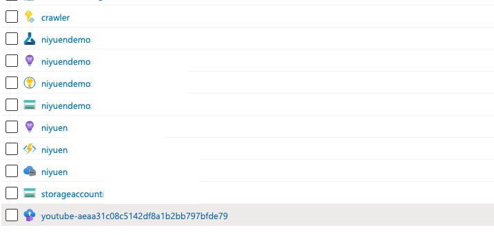
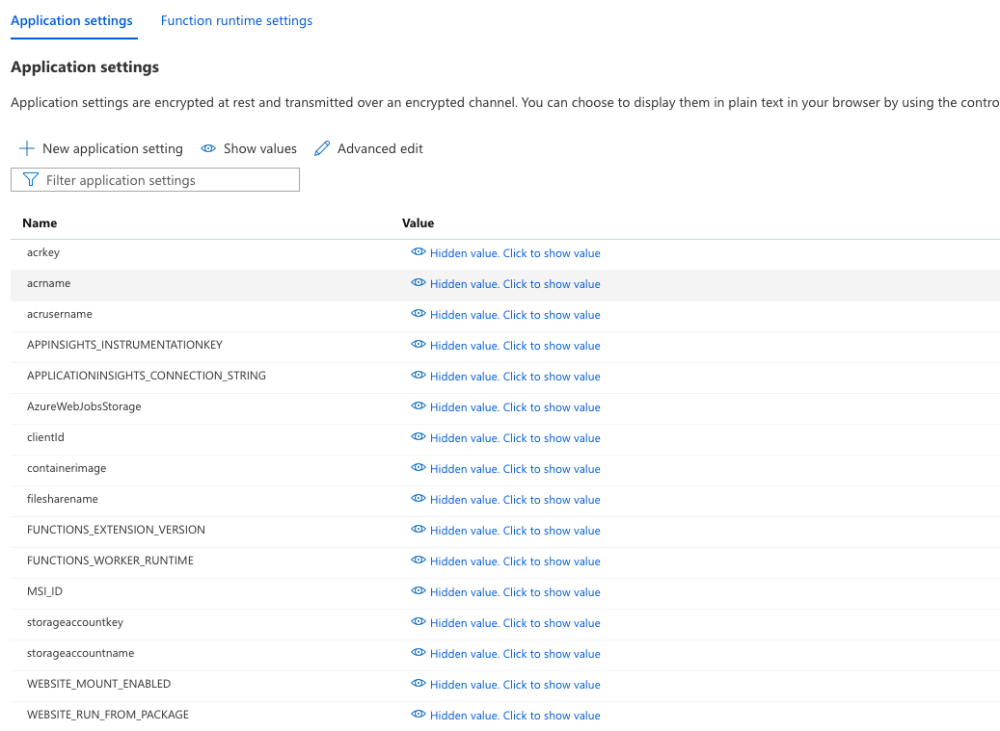
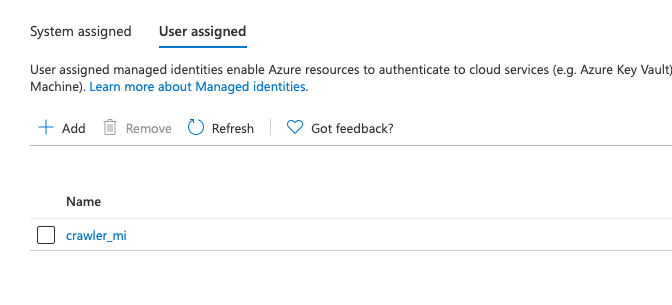

# Serverless Video Downloader using Azure Durable Functions and Container Instances

This samples shows how you can orchestrate the life cycle of Azure Container Instances using Azure Durable Functions 3 in a in true serverless fashion. Azure Durable Functions are used to do the orchestration of the container deployment, monitoring and cleanup of Azure Container Instances. Azure Container registry stores the container images. Used Azure Active Directory and Managed Service Identity within Functions to manage the Container Instances.

This example contains two project:

* A simple container based on youtube-dl and FFMPEG to download a youtube video and store the result in a storage account (from mikenye/docker-youtube-dl)
* A serverless orchestrator based on Azure Durable Functions (from sowsan/az-func-aci)

The project is meant to be deployed on Azure. You will need to deploy the following resources:

* A resource Group - I've named mine ML-Training-RG in the code of this example
* An Azure Function resource using (Consumption plan aka serverless works)
* A Storage Account
    **A File share to be used as a file mount to ACI - note that you could use an emptyDir volume using a YAML file
    **A Container to store the downloaded youtube videos
* A User managed Identity: The managed identity will be used on both the Durable Function and the Azure container instance to authenticate to the Azure Management API
* An Azure Container registry to store the docker image for the batch
* (Optional) ApplicationInsight deployed with Azure Function



For the Development environment you need:

* Dotnetcore v3.1
* Azure function runtime
* Azure CLI


1. A HTTP Trigger will invoke the Azure Durable Function to orchestrate the container deployment.
1. First activity function will create the ACI group and with the container image stored in the Azure Container Registry. Used [Azure Fluent API](https://github.com/Azure/azure-libraries-for-net) and [ACI Management libraries](https://docs.microsoft.com/dotnet/api/overview/azure/containerinstance?view=azure-dotnet) for accomplishing this task. The Function uses a User Managed Idenitity to call the Azure management API and create an Azure Container Instance based on an image stored in a Azure Container Registry
1. Upon initialization the container (containing youtube-dl and FFMPEG) will fetch the youtube video passed through an environment variable, connect to the Azure CLI using the User Managed Identity and upload the MP4 to the target blob storage. Once completed, the job will clean up temp files (mounted as an Azure File Share).
1. Once the job completed successfully, the program within the container will invoke the Azure Durable Function by [raising an external event](https://docs.microsoft.com/azure/azure-functions/durable/durable-functions-external-events?tabs=csharp) and provides the status of the Job stating whether its completed or failed.
1. Container Group will be deleted or stopped depending on the status from the step #4. Please refer the options [here](https://docs.microsoft.com/azure/container-instances/container-instances-stop-start). You can also control the container instance using [restart policies](https://docs.microsoft.com/azure/container-instances/container-instances-restart-policy)

## Deploying the solution - step by step

1. Create a resource group (in my code sample I've called it ML-Training-RG), change the code accordingly
1. Create a Storage account
    1. Create an Blob Container (I've called mine "youtube")
    1. Create a File Share (I've called mine "temp-youtube")
1. Create a User Managed Identity and give the following permissions:
    1. Contributor to the resource group (required to create new resources)
    1. Storage Blob Data Contributor on the Storage Account
1. Create an Azure function - I've used the Comsumption Plan
1. Create an Azure Container registry - you will need to generate Admin username / password for the ACI to read the repo, alternatively you can create a dedicated service principal with read access to the registry
1. On the Azure function, navigate to Configuration and fill in a the app settings that are required in the code
    1. acrusername: the Admin user name of the Azure Container Registry
    1. acrkey: the secret associated to the Admin user to connect to the Azure Containter Registry
    1. acrname: the name of the Container Registry (abcdef.azurecr.io)
    1. clientId: the clientId associated to the User Assigned Identity
    1. containerimage: the container image reference (abcdef.azurecr.io/myimage:tag)
    1. MSI_ID: the resoure ID of the User Assigned Identity - this will be passed to the Azure Container Instance on creation
    1. filesharename: the name of the Azure File Share that will be mounted to the Azure Container Instance
    1. storageaccountname: the name of the storage account containing the Blob Container and the File Share
    1. storageaccountkey: the key to access the storage account
1. On the Azure Function App, navigate to Identity and select User Assigned
    1.Add the User Identity created in step 3
1. Build the Container:
    1. az acr login -n name_of_your_registry
    1. docker build -t image_name:tag .
    1. docker push image_name:tag
1. Deploy the Azure Functions
    1. cd AzureFunction
    1. func azure functionapp publish name_of_your_function_app --dotnet





## Testing the container
To test the container you will need to replace the User Managed Identity authentication by a Service Principal Authentication and then run the container by passing the required environment variables. the $HOME/workdir folder will be mounted in the container
```
docker run \
    --rm -i \
    -e PGID=$(id -g) \
    -e PUID=$(id -u) \
    -e CLIENT_ID=$CLIENT_ID \
    -e CLIENT_SECRET="$CLIENT_SECRET" \
    -e STORAGE_ACCOUNT=$STORAGE_ACCOUNT \
    -e RESOURCE_GROUP=$RESOURCE_GROUp_NAME \
    -e STORAGE_CONTAINER="youtube" \
    -e AZURE_TENANT=$TENANT_ID \
    -v $HOME/workdir:rw \
    mycontainer
```

## Testing the Azure Function

You can test the Azure Function locally if you remove the User Managed Identity authentication layer and replace it with a Service Principal authentication for instance. To test the function locally create a local.settings.json file to provide the required app settings/environment variables.

Run the Azure function locally using the Visual studio code extension or through the command line interface : `func start`

You can then use POSTMAN or any other tool to generate a web request to your Azure function, either running on Azure or locally, make sure that the target youtube URL is provided as a raw payload to the POST request:

```
curl -X POST https://your_azure_function.azurewebsites.net/api/orchestrator_httpstart -d "https://www.youtube.com/watch\?v\=SAMPLE_YOUTUBE_VIDEO"
```
The request should provide a JSON response with the following format:

```
{
    "id": "xxxxxxxxxxxxxxxxxxxxxxxx",
    "statusQueryGetUri": "https://your_azure_function.azurewebsites.net/runtime/webhooks/durabletask/instances/xxxxxxxxxxxxxxxxxxxxxxxx?taskHub=your_azure_function&connection=Storage&code=aaaaaaaaaaaaaaaaaaaaaaaaaaaaaaaaaaaa==",
    "sendEventPostUri": "https://your_azure_function.azurewebsites.net/runtime/webhooks/durabletask/instances/xxxxxxxxxxxxxxxxxxxxxxxx/raiseEvent/{eventName}?taskHub=your_azure_function&connection=Storage&code=aaaaaaaaaaaaaaaaaaaaaaaaaaaaaaaaaaaa==",
    "terminatePostUri": "https://your_azure_function.azurewebsites.net/runtime/webhooks/durabletask/instances/xxxxxxxxxxxxxxxxxxxxxxxx/terminate?reason={text}&taskHub=your_azure_function&connection=Storage&code=aaaaaaaaaaaaaaaaaaaaaaaaaaaaaaaaaaaa==",
    "purgeHistoryDeleteUri": "https://your_azure_function.azurewebsites.net/runtime/webhooks/durabletask/instances/xxxxxxxxxxxxxxxxxxxxxxxx?taskHub=your_azure_function&connection=Storage&code=aaaaaaaaaaaaaaaaaaaaaaaaaaaaaaaaaaaa==",
    "restartPostUri": "https://your_azure_function.azurewebsites.net/runtime/webhooks/durabletask/instances/xxxxxxxxxxxxxxxxxxxxxxxx/restart?taskHub=your_azure_function&connection=Storage&code=aaaaaaaaaaaaaaaaaaaaaaaaaaaaaaaaaaaa=="
}
```

